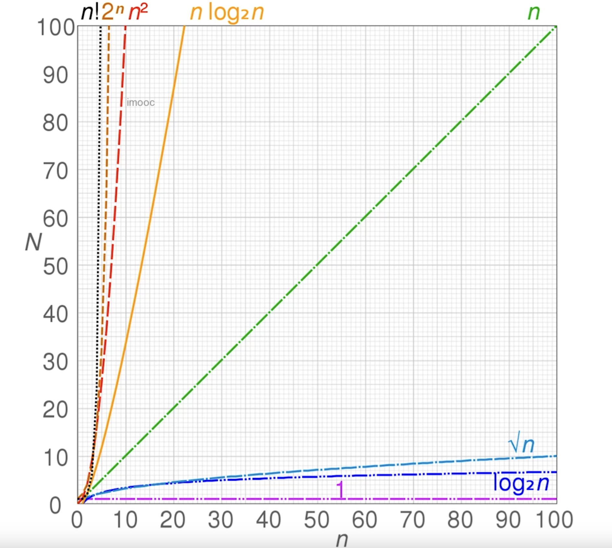
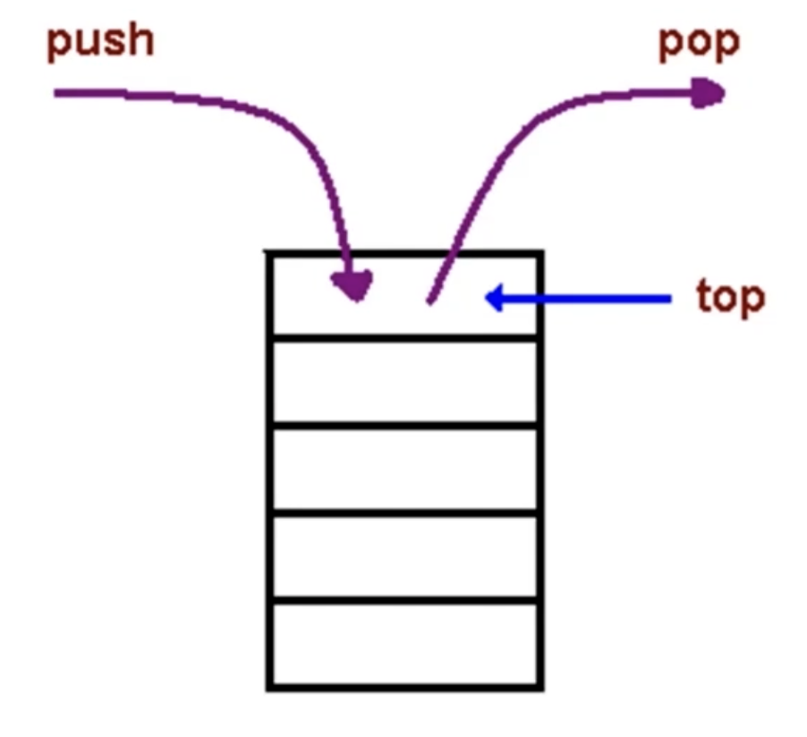

# JS-Data-Structure-and-Algorithms

## 数据结构与算法的关系
`程序 = 数据结构 + 算法`
数据结构为算法提供服务，算法围绕数据结构操作

## 将要学习的数据结构
- 栈、队列、链表。
- 集合、字典。
- 树、堆、图。

## 将要学习的算法
- 链表：遍历链表、删除链表节点。
- 树、图：深度/广度优先遍历。
- 数组：冒泡/选择/插入/归并/快速排序、顺序/二分搜索。

## 时间复杂度
一个函数，用大O表示，比如O(1)、O(n)、O(logN)...
定性描述该算法的运行时间趋势。

- `O(1)`:
  ```js
    let i = 0;
    i += 1;
  ```
- `O(n)`:
  ```js
    for (let i = 0; i < n; i+=1) {
      console.log(i);
    }
  ```
- `O(logN)`:
  ```js
    let i = 1;
    while (i < n) {
      conosole.log(i);
      i *= 2;
    }
  ```

## 空间复杂度
一个函数，用大O表示，比如O(1)、O(n)、O(n^2)
算法在运行过程中临时占用存储空间大小的量度。
- `O(1)`:
  ```js
    let i = 0;
    i += 1;
  ```
- `O(n)`:
  ```js
    const list = [];
    for (let i = 0; i < n; i += 1) {
      list.push(i);
    }
  ```
- `O(n^2)`:
  ```js
    const matrix = [];
    for (let i = 0; i < n; i += 1) {
      matrix.push([]);
      for (let j = 0; j < n; j += 1) {
        matrix[i].push(j);
      }
    }
  ```

## 栈
  - 一个**后进先出**的数据结构。
  - JavaScript中没有栈，但可以用Array实现栈的所有功能。

  - 场景一：十进制转二进制
  - 场景二：有效的括号
    - 新建一个栈
    - 扫描字符串，遇到左括号入栈，遇到和栈顶括号类型匹配的右括号就出栈，类型不匹配直接判定为不合法。
    - 最后栈空了就合法，否则不合法。
  - 场景三：函数调用堆栈